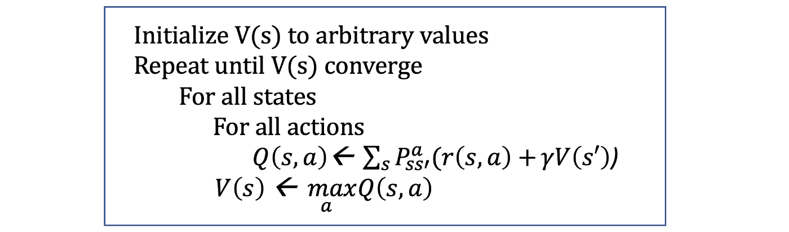
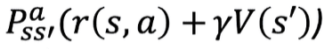

I was lending a hand to my friend this weekend who had to create an agent who would be able to play a dice game using an algorithm called [value iteration](https://towardsdatascience.com/the-value-iteration-algorithm-4714f113f7c5). I must admit, that it was scary at the beginning as I have not touched any proper maths since uni days. However, after replaying a few YouTube videos dozens of times, the formula became quite clear and natural.

So what is value iteration? In academic terms, value iteration is a method used to compute the optimal policy for choosing actions in an environment where situations are partly random and partly depend on the decision maker - the environment which is described by Markov Decision Process. 

The pseudo-code of the algorithm looks like this: 

In words, it means that we continuously iterate through all the possible states and compute their value using a simple formula until the values start converging. After we converge to a certain point for each state, we can then use those final values as a guidance to make our decisions.

The *simple formula* that I mentioned, is the one to take a closer look at. It is this portion  and it literally means that the value of action is the probability of its success (_p_) times the sum of reward (_r_) and the previous state value (_V(s')_). 

> Choose actions that have the highest probability and reward ratio and those will lead you to even better circumstances in life. That is my lesson from Mr. Bellman.

To put it into real world example, think of an entrepreneurial venture. Starting a business is definitely one of the riskiest paths one could take because there are just so many unknowns and many startups eventually fail. However, if one succeeds, the reward is much higher than simply being an employee in a stable company. Staying in a company or even getting a job has a relatively high probability but rewards are much lower (salary can only get you that far).

Even though the algorithm itself is too simple to directly apply to real world situations, it provides a useful framework to use when making everyday decisions.